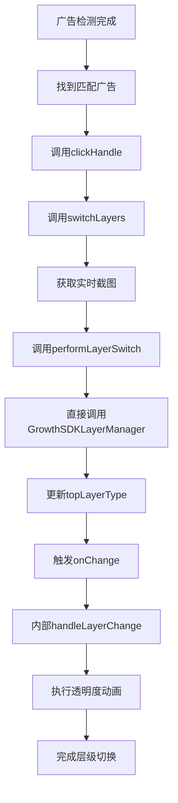

# GrowthSDK SDK 改进设计 - 内部层级切换管理

## 🎯 设计目标

### 问题分析
原来的实现使用通知机制让外部调用者处理层级切换，这违背了SDK封装的原则：
- 外部需要监听通知
- 外部需要实现层级切换逻辑
- 增加了集成的复杂性
- 暴露了SDK内部实现细节

### 改进目标
- SDK内部完全管理层级切换
- 对外提供简洁的接口
- 隐藏内部实现细节
- 提供平滑的切换动画

## 🏗️ 新的架构设计

### 1. 内部层级切换管理

```swift
// GrowthSDKSwiftUIView 内部管理层级切换
public struct GrowthSDKSwiftUIView<GameView: View>: View {
    
    @StateObject private var layerManager = GrowthSDKLayerManager.shared
    @State private var gameViewOpacity: Double = 1.0
    @State private var webViewOpacity: Double = 0.0
    
    public var body: some View {
        ZStack {
            // WebView层
            SingleLayerWebContainer()
                .zIndex(layerManager.sWebZIndex)
                .opacity(webViewOpacity) // 👈 通过透明度控制显示
            
            // 游戏层
            gameView
                .opacity(gameViewOpacity) // 👈 通过透明度控制显示
                .zIndex(layerManager.unityZIndex)
            
            // 弹窗层
            if showPopupView {
                CustomPopupView { ... }
                    .zIndex(layerManager.popupZIndex)
            }
        }
        .onChange(of: layerManager.topLayerType) { newValue in
            handleLayerChange(newValue) // 👈 内部处理层级变化
        }
    }
    
    // 内部层级切换逻辑
    private func handleLayerChange(_ layerType: LayerType) {
        switch layerType {
        case .unity:
            bringGameToTop()
        case .webView:
            bringWebViewToTop()
        }
    }
    
    private func bringGameToTop() {
        withAnimation(.easeInOut(duration: 0.3)) {
            gameViewOpacity = 1.0
            webViewOpacity = 0.0
        }
    }
    
    private func bringWebViewToTop() {
        withAnimation(.easeInOut(duration: 0.3)) {
            gameViewOpacity = 0.0
            webViewOpacity = 1.0
        }
        updatePopupPositionShow()
    }
}
```

### 2. 直接调用层级管理器

```swift
// SingleLayerViewModel 直接调用层级管理器
private func performLayerSwitch() {
    // 直接调用层级管理器的切换方法
    GrowthSDKLayerManager.shared.bringWebViewToTop()
    isLayerSwitched = true
    print("[H5] [SingleLayerVM] 🔄 层级已切换，WebView 在顶层")
    
    setupClickAdTime()
}
```

## 🚀 使用方式对比

### 原来的实现（复杂）
```swift
// 外部需要监听通知
NotificationCenter.default.addObserver(
    forName: .gameWrapperLayerSwitch,
    object: nil,
    queue: .main
) { notification in
    // 外部需要实现层级切换逻辑
    if let userInfo = notification.userInfo,
       let targetLayer = userInfo["targetLayer"] as? String {
        switch targetLayer {
        case "webView":
            self.bringWebViewToFront()
        case "unity":
            self.bringUnityToFront()
        }
    }
}

// 外部需要实现具体的切换逻辑
private func bringWebViewToFront() {
    view.bringSubviewToFront(webView)
}

private func bringUnityToFront() {
    view.bringSubviewToFront(unityView)
}
```

### 改进后的实现（简洁）
```swift
// 外部只需要提供游戏视图和截图方法
GrowthSDKSwiftUIView(
    gameView: {
        UnityViewWrapper()
            .frame(maxWidth: .infinity, maxHeight: .infinity)
    },
    screenshotProvider: {
        return UnityViewWrapper.shared.takeScreenshot()
    }
)
// 👆 就这么简单！SDK内部处理所有层级切换逻辑
```

## 🎨 层级切换动画

### 透明度动画
```swift
private func bringWebViewToTop() {
    withAnimation(.easeInOut(duration: 0.3)) {
        gameViewOpacity = 0.0  // 游戏层淡出
        webViewOpacity = 1.0   // WebView层淡入
    }
    updatePopupPositionShow()
}
```

### 动画效果
- **平滑过渡**: 0.3秒的缓入缓出动画
- **视觉连续性**: 通过透明度变化实现平滑切换
- **用户体验**: 避免突兀的层级跳转

## 🔧 技术实现细节

### 1. 状态管理
```swift
@State private var gameViewOpacity: Double = 1.0
@State private var webViewOpacity: Double = 0.0
```

### 2. 层级监听
```swift
.onChange(of: layerManager.topLayerType) { newValue in
    handleLayerChange(newValue)
}
```

### 3. 内部切换逻辑
```swift
private func handleLayerChange(_ layerType: LayerType) {
    switch layerType {
    case .unity:
        bringGameToTop()
    case .webView:
        bringWebViewToTop()
    }
}
```

## 📊 优势对比

| 方面 | 原来的实现 | 改进后的实现 |
|------|------------|--------------|
| **集成复杂度** | 高（需要监听通知+实现切换逻辑） | 低（只需要提供视图和截图） |
| **封装性** | 差（暴露内部实现） | 好（完全封装） |
| **维护性** | 差（外部需要维护切换逻辑） | 好（SDK内部维护） |
| **一致性** | 差（不同项目实现可能不同） | 好（统一的行为） |
| **动画效果** | 无（直接切换） | 好（平滑动画） |

## 🎯 核心改进点

### 1. 消除外部依赖
- ❌ 不再需要外部监听通知
- ❌ 不再需要外部实现切换逻辑
- ✅ SDK内部完全管理层级切换

### 2. 简化集成接口
- ❌ 复杂的通知监听代码
- ✅ 简洁的视图提供接口

### 3. 增强用户体验
- ❌ 突兀的层级跳转
- ✅ 平滑的透明度动画

### 4. 提高封装性
- ❌ 暴露内部实现细节
- ✅ 隐藏所有内部逻辑

## 🔄 数据流



## 🎉 总结

改进后的设计实现了真正的SDK封装：

1. **内部管理**: SDK内部完全管理层级切换逻辑
2. **简洁接口**: 外部只需要提供游戏视图和截图方法
3. **平滑动画**: 通过透明度变化实现优雅的切换效果
4. **完全封装**: 隐藏所有内部实现细节

这样的设计让SDK更加易用、可靠和一致，符合良好的SDK设计原则。 